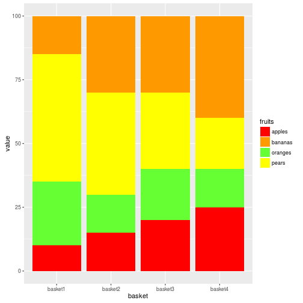
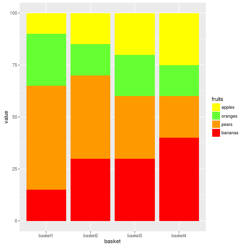
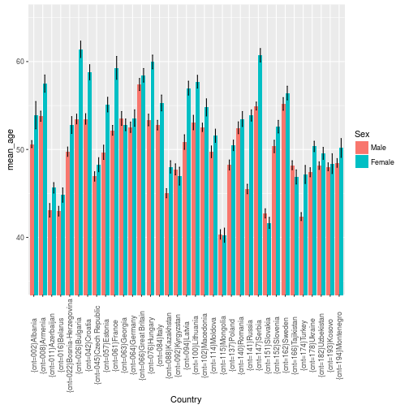
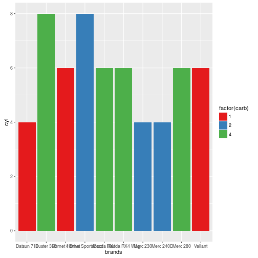
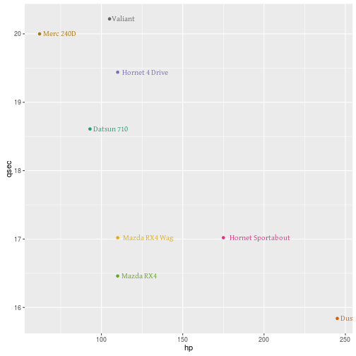

`Last time updated: **2016-03-03 16:19:23**`

# Data manipulation

- [tidyr & dplyr cheatsheet](http://www.rstudio.com/wp-content/uploads/2015/01/data-wrangling-cheatsheet.pd)
- [Garrett Grolemund - Data Wrangling with R slaidit](https://dl.dropboxusercontent.com/u/5896466/wrangling-webinar.pdf)

##  Create the data sets

```r
library(tidyr)
library(dplyr)
# cases
df <- data.frame(country = c("FR", "DE", "US", "FR", "DE", "US", "FR", "DE", "US"),
                 year = c(2011,2011,2011,2012,2012,2012,2013,2013,2013),
                 n = c(7000,5800,15000,6900,6000,14000,7000,6200,13000),
                 stringsAsFactors = FALSE)
cases <- spread(df, year, n)
#                      
df <- data.frame(city = c("New York", "New York", "London", "London", "Beijing", "Beijing"),
                 size = c("large", "small", "large", "small", "large", "small"),
                 amount = c(23,14,22,16,121,56),
                 stringsAsFactors = FALSE)
pollution <- df
# storms
storms <- data.frame(storm = c("Alberto", "Alex", "Allison", "Ana", "Arlene", "Arthur"),
                     wind = c(110,45,65,40,50,45),
                     pressure = c(1007,1009,1005,1013,1010,1010),
                     date = as.Date(c("2000-08-03", "1998-07-27", "1995-06-03", "1997-06-30", "1999-06-11", "1996-06-17")),
                     stringsAsFactors = FALSE)
# songs
songs <- data.frame(song = c("Across the Universe", "Come Together", "Hello, Goodbye", "Peggy Sue"),
                    name = c("John", "John", "Paul", "Buddy"),
                    stringsAsFactors = FALSE)
# artists
artists <- data.frame(name = c("George", "John", "Paul", "Ringo"),
                    plays = c("sitar", "guitar", "bass", "drums"),
                    stringsAsFactors = FALSE)
```

## tidyr


```r
cases
```

```
##   country  2011  2012  2013
## 1      DE  5800  6000  6200
## 2      FR  7000  6900  7000
## 3      US 15000 14000 13000
```

```r
gather(cases, # data
       "year", # name of the key variable
       "n", # name of valut var
       2:4) # variables NOT tidy
```

```
##   country year     n
## 1      DE 2011  5800
## 2      FR 2011  7000
## 3      US 2011 15000
## 4      DE 2012  6000
## 5      FR 2012  6900
## 6      US 2012 14000
## 7      DE 2013  6200
## 8      FR 2013  7000
## 9      US 2013 13000
```


```r
pollution
```

```
##       city  size amount
## 1 New York large     23
## 2 New York small     14
## 3   London large     22
## 4   London small     16
## 5  Beijing large    121
## 6  Beijing small     56
```

```r
spread(pollution, # data
       size, # class-var
       amount) # amount
```

```
##       city large small
## 1  Beijing   121    56
## 2   London    22    16
## 3 New York    23    14
```


```r
storms
```

```
##     storm wind pressure       date
## 1 Alberto  110     1007 2000-08-03
## 2    Alex   45     1009 1998-07-27
## 3 Allison   65     1005 1995-06-03
## 4     Ana   40     1013 1997-06-30
## 5  Arlene   50     1010 1999-06-11
## 6  Arthur   45     1010 1996-06-17
```

```r
storms2 <- separate(storms, date, c("year", "month", "day"), sep = "-")
storms2
```

```
##     storm wind pressure year month day
## 1 Alberto  110     1007 2000    08  03
## 2    Alex   45     1009 1998    07  27
## 3 Allison   65     1005 1995    06  03
## 4     Ana   40     1013 1997    06  30
## 5  Arlene   50     1010 1999    06  11
## 6  Arthur   45     1010 1996    06  17
```

```r
unite(storms2, "date", year, month, day, sep = "-")
```

```
##     storm wind pressure       date
## 1 Alberto  110     1007 2000-08-03
## 2    Alex   45     1009 1998-07-27
## 3 Allison   65     1005 1995-06-03
## 4     Ana   40     1013 1997-06-30
## 5  Arlene   50     1010 1999-06-11
## 6  Arthur   45     1010 1996-06-17
```


## dplyr


```r
library(dplyr)
library(ggplot2)
tbl_df(diamonds)
```

```
## Source: local data frame [53,940 x 10]
## 
##    carat       cut  color clarity depth table price     x     y     z
##    (dbl)    (fctr) (fctr)  (fctr) (dbl) (dbl) (int) (dbl) (dbl) (dbl)
## 1   0.23     Ideal      E     SI2  61.5    55   326  3.95  3.98  2.43
## 2   0.21   Premium      E     SI1  59.8    61   326  3.89  3.84  2.31
## 3   0.23      Good      E     VS1  56.9    65   327  4.05  4.07  2.31
## 4   0.29   Premium      I     VS2  62.4    58   334  4.20  4.23  2.63
## 5   0.31      Good      J     SI2  63.3    58   335  4.34  4.35  2.75
## 6   0.24 Very Good      J    VVS2  62.8    57   336  3.94  3.96  2.48
## 7   0.24 Very Good      I    VVS1  62.3    57   336  3.95  3.98  2.47
## 8   0.26 Very Good      H     SI1  61.9    55   337  4.07  4.11  2.53
## 9   0.22      Fair      E     VS2  65.1    61   337  3.87  3.78  2.49
## 10  0.23 Very Good      H     VS1  59.4    61   338  4.00  4.05  2.39
## ..   ...       ...    ...     ...   ...   ...   ...   ...   ...   ...
```

```r
diamonds$x %>%
  mean() %>%
  round(2)
```

```
## [1] 5.73
```

### select() - subset rows


```r
storms
# drop vars
select(storms, -storm)
# subset rows
filter(storms, wind >= 50)
# subset rows - multiple conditions
filter(storms,
       wind >= 50,
       storm %in% c("Alberto", "Alex", "Allison"))
```


#### More select-commands


```r
- # Select everything but
: # Select range
contains() # Select columns whose name contains a character string
ends_with() # Select columns whose name ends with a string
everything() # Select every column
matches() # Select columns whose name matches a regular expression
num_range() # Select columns named x1, x2, x3, x4, x5
one_of() # Select columns whose names are in a group of names
starts_with() # Select columns whose name starts with a character string
```


### mutate () - create new vars


```r
mutate(storms, ratio = pressure / wind)
```

```
##     storm wind pressure       date     ratio
## 1 Alberto  110     1007 2000-08-03  9.154545
## 2    Alex   45     1009 1998-07-27 22.422222
## 3 Allison   65     1005 1995-06-03 15.461538
## 4     Ana   40     1013 1997-06-30 25.325000
## 5  Arlene   50     1010 1999-06-11 20.200000
## 6  Arthur   45     1010 1996-06-17 22.444444
```

```r
mutate(storms,ratio = pressure / wind,
       inverse = ratio^-1)
```

```
##     storm wind pressure       date     ratio    inverse
## 1 Alberto  110     1007 2000-08-03  9.154545 0.10923535
## 2    Alex   45     1009 1998-07-27 22.422222 0.04459861
## 3 Allison   65     1005 1995-06-03 15.461538 0.06467662
## 4     Ana   40     1013 1997-06-30 25.325000 0.03948667
## 5  Arlene   50     1010 1999-06-11 20.200000 0.04950495
## 6  Arthur   45     1010 1996-06-17 22.444444 0.04455446
```

#### More mutate fuctions

>All take a vector of values and return a vector of values


```r
pmin(), pmax() # Element-wise min and max
cummin(), cummax() # Cumulative min and max
cumsum(), cumprod() # Cumulative sum and product
between() # Are values between a and b?
cume_dist() # Cumulative distribution of values
cumall(), cumany() # Cumulative all and any
cummean() # Cumulative mean
lead(), lag() # Copy with values one position
ntile() #Bin vector into n buckets
dense_rank(), min_rank(), percent_rank(), row_number() # Various ranking methods
```


### summarise() - Change unit


```r
pollution %>% 
  summarise(median = median(amount), 
            variance = var(amount))
```

```
##   median variance
## 1   22.5   1731.6
```

#### Good summary functions

> All take a vector of values and return a single value


```r
min(), max() # Minimum and maximum values
mean() # Mean value
median() # Median value
sum() # Sum of values
var, sd() # Variance and standard deviation of a vector
first() # First value in a vector
last() # Last value in a vector
nth() # Nth value in a vector
n() # The number of values in a vector
n_distinct() # The number of distinct values in a vector
```


### Grouped analysis


```r
h <- pollution %>% group_by(city)
h
```

```
## Source: local data frame [6 x 3]
## Groups: city [3]
## 
##       city  size amount
##      (chr) (chr)  (dbl)
## 1 New York large     23
## 2 New York small     14
## 3   London large     22
## 4   London small     16
## 5  Beijing large    121
## 6  Beijing small     56
```

```r
ungroup(h)
```

```
## Source: local data frame [6 x 3]
## 
##       city  size amount
##      (chr) (chr)  (dbl)
## 1 New York large     23
## 2 New York small     14
## 3   London large     22
## 4   London small     16
## 5  Beijing large    121
## 6  Beijing small     56
```


```r
pollution
```

```
##       city  size amount
## 1 New York large     23
## 2 New York small     14
## 3   London large     22
## 4   London small     16
## 5  Beijing large    121
## 6  Beijing small     56
```

```r
pollution  %>% group_by(city) %>%
  summarise(mean = mean(amount),
            sum = sum(amount),
            n = n())
```

```
## Error in n(): This function should not be called directly
```


```r
pollution %>% 
  group_by(city) %>% 
  summarise(mean = mean(amount), sum = sum(amount), n = n())
```

```
## Error in n(): This function should not be called directly
```


```r
# data(tb)
# tb %>% 
#   group_by(country, year) %>% 
#   summarise(cases = sum(cases)) %>% 
#   summarise(cases = sum(cases))

Error in FUN(X[[1L]], ...) : 
  only defined on a data frame with all numeric variable
```

### Rank groups

rank by which "cylinder group" highest total hp. (makes no sense, but was useful)


```r
library(dplyr)
mtcars %>% 
  slice(1:10) %>% 
  select(cyl,hp) %>% 
  group_by(cyl) %>% 
  mutate(sum_hp = sum(hp, na.rm = TRUE)) %>% 
  ungroup() %>% 
  arrange(sum_hp) %>% 
  mutate(rank = dense_rank(sum_hp))
```

```
## Error in select(., cyl, hp): unused arguments (cyl, hp)
```


### Järjestä data


```r
arrange(storms, wind)
```

```
##     storm wind pressure       date
## 1     Ana   40     1013 1997-06-30
## 2    Alex   45     1009 1998-07-27
## 3  Arthur   45     1010 1996-06-17
## 4  Arlene   50     1010 1999-06-11
## 5 Allison   65     1005 1995-06-03
## 6 Alberto  110     1007 2000-08-03
```

```r
arrange(storms, -wind)
```

```
##     storm wind pressure       date
## 1 Alberto  110     1007 2000-08-03
## 2 Allison   65     1005 1995-06-03
## 3  Arlene   50     1010 1999-06-11
## 4    Alex   45     1009 1998-07-27
## 5  Arthur   45     1010 1996-06-17
## 6     Ana   40     1013 1997-06-30
```

```r
arrange(storms, desc(wind), desc(date))
```

```
##     storm wind pressure       date
## 1 Alberto  110     1007 2000-08-03
## 2 Allison   65     1005 1995-06-03
## 3  Arlene   50     1010 1999-06-11
## 4    Alex   45     1009 1998-07-27
## 5  Arthur   45     1010 1996-06-17
## 6     Ana   40     1013 1997-06-30
```

### the pipe operatos


```r
storms %>% 
  filter(wind >= 50) %>% 
  select(storm, pressure)
```

```
## Error in select(., storm, pressure): unused arguments (storm, pressure)
```

```r
pollution  %>% group_by(city) %>%
  summarise(mean = mean(amount),
            sum = sum(amount),
            n = n())
```

```
## Error in n(): This function should not be called directly
```

```r
storms %>% 
  mutate(ratio = pressure / wind) %>%
  select(storm, ratio)
```

```
## Error in select(., storm, ratio): unused arguments (storm, ratio)
```

```r
pollution  %>% group_by(city) %>%
  mutate(mean = mean(amount),
            sum = sum(amount),
            n = n())
```

```
## Error in n(): This function should not be called directly
```

### join() - merging data.frames


```r
library(dplyr)

songs
```

```
##                  song  name
## 1 Across the Universe  John
## 2       Come Together  John
## 3      Hello, Goodbye  Paul
## 4           Peggy Sue Buddy
```

```r
artists
```

```
##     name  plays
## 1 George  sitar
## 2   John guitar
## 3   Paul   bass
## 4  Ringo  drums
```

```r
left_join(songs, artists, by = "name")
```

```
##                  song  name  plays
## 1 Across the Universe  John guitar
## 2       Come Together  John guitar
## 3      Hello, Goodbye  Paul   bass
## 4           Peggy Sue Buddy   <NA>
```

```r
inner_join(songs, artists, by = "name")
```

```
##                  song name  plays
## 1 Across the Universe John guitar
## 2       Come Together John guitar
## 3      Hello, Goodbye Paul   bass
```

```r
#outer_join(songs, artists, by = "name")

semi_join(songs, artists, by = "name")
```

```
##                  song name
## 1 Across the Universe John
## 2       Come Together John
## 3      Hello, Goodbye Paul
```

```r
anti_join(songs, artists, by = "name")
```

```
##        song  name
## 1 Peggy Sue Buddy
```


```r
dplyr::bind_cols(x,y)
dplyr::bind_rows
dplyr::union
dplyr::intersect
dplyr::setdif
```


## Base-R

### Na solujen poistaminen


```r
# yksi muuttuja
df <- df[!is.na(df$Var1),]
# kaikki rivit joilla na
df2 <- na.omit(df) 
```

### Faktorit numeerisiksi


```r
d <- storms
d$f <- as.character(d$wind)
d
```

```
##     storm wind pressure       date   f
## 1 Alberto  110     1007 2000-08-03 110
## 2    Alex   45     1009 1998-07-27  45
## 3 Allison   65     1005 1995-06-03  65
## 4     Ana   40     1013 1997-06-30  40
## 5  Arlene   50     1010 1999-06-11  50
## 6  Arthur   45     1010 1996-06-17  45
```

```r
mean(d$f)
```

```
## [1] NA
```

```r
d$f <- factor(d$f)
d$f <- as.numeric(levels(d$f))[d$f]

mean(d$f)
```

```
## [1] 59.16667
```

```r
# Or 

d$f <- as.integer(d$f)
mean(d$f)
```

```
## [1] 59.16667
```

### Removing duplicats


```r
d <- rbind(storms,storms)
d
```

```
##      storm wind pressure       date
## 1  Alberto  110     1007 2000-08-03
## 2     Alex   45     1009 1998-07-27
## 3  Allison   65     1005 1995-06-03
## 4      Ana   40     1013 1997-06-30
## 5   Arlene   50     1010 1999-06-11
## 6   Arthur   45     1010 1996-06-17
## 7  Alberto  110     1007 2000-08-03
## 8     Alex   45     1009 1998-07-27
## 9  Allison   65     1005 1995-06-03
## 10     Ana   40     1013 1997-06-30
## 11  Arlene   50     1010 1999-06-11
## 12  Arthur   45     1010 1996-06-17
```

```r
d[!duplicated(d[c("storm","wind","pressure")]),]
```

```
##     storm wind pressure       date
## 1 Alberto  110     1007 2000-08-03
## 2    Alex   45     1009 1998-07-27
## 3 Allison   65     1005 1995-06-03
## 4     Ana   40     1013 1997-06-30
## 5  Arlene   50     1010 1999-06-11
## 6  Arthur   45     1010 1996-06-17
```


### Renaming variables


```r
# built-in
names(d)[names(d)=="storm"] <- "newName"
d
```

```
##    newName wind pressure       date
## 1  Alberto  110     1007 2000-08-03
## 2     Alex   45     1009 1998-07-27
## 3  Allison   65     1005 1995-06-03
## 4      Ana   40     1013 1997-06-30
## 5   Arlene   50     1010 1999-06-11
## 6   Arthur   45     1010 1996-06-17
## 7  Alberto  110     1007 2000-08-03
## 8     Alex   45     1009 1998-07-27
## 9  Allison   65     1005 1995-06-03
## 10     Ana   40     1013 1997-06-30
## 11  Arlene   50     1010 1999-06-11
## 12  Arthur   45     1010 1996-06-17
```

```r
# using plyr
plyr::rename(d, c("wind"="newName2", "pressure"="newName3"))
```

```
##    newName newName2 newName3       date
## 1  Alberto      110     1007 2000-08-03
## 2     Alex       45     1009 1998-07-27
## 3  Allison       65     1005 1995-06-03
## 4      Ana       40     1013 1997-06-30
## 5   Arlene       50     1010 1999-06-11
## 6   Arthur       45     1010 1996-06-17
## 7  Alberto      110     1007 2000-08-03
## 8     Alex       45     1009 1998-07-27
## 9  Allison       65     1005 1995-06-03
## 10     Ana       40     1013 1997-06-30
## 11  Arlene       50     1010 1999-06-11
## 12  Arthur       45     1010 1996-06-17
```

```r
# using dplyr
dplyr::rename(d, newName2=wind, newName3=pressure)
```

```
##    newName newName2 newName3       date
## 1  Alberto      110     1007 2000-08-03
## 2     Alex       45     1009 1998-07-27
## 3  Allison       65     1005 1995-06-03
## 4      Ana       40     1013 1997-06-30
## 5   Arlene       50     1010 1999-06-11
## 6   Arthur       45     1010 1996-06-17
## 7  Alberto      110     1007 2000-08-03
## 8     Alex       45     1009 1998-07-27
## 9  Allison       65     1005 1995-06-03
## 10     Ana       40     1013 1997-06-30
## 11  Arlene       50     1010 1999-06-11
## 12  Arthur       45     1010 1996-06-17
```

### Rename factor levels


```r
# built-in
levels(x)[levels(x)=="one"] <- "uno"
levels(x)[3] <- "three"
levels(x) <- c("one","two","three")

# plyr
library(plyr)
revalue(x, c("beta"="two", "gamma"="three"))
mapvalues(x, from = c("beta", "gamma"), to = c("two", "three"))
```

### Subset data


```r
# based on regexpr in string
d[ with(d, grepl("Ar", newName)),]
```

```
##    newName wind pressure       date
## 5   Arlene   50     1010 1999-06-11
## 6   Arthur   45     1010 1996-06-17
## 11  Arlene   50     1010 1999-06-11
## 12  Arthur   45     1010 1996-06-17
```

```r
# subset string
s <- d$newName
s[grepl("Ar",s)]
```

```
## [1] "Arlene" "Arthur" "Arlene" "Arthur"
```

### Remove objects from workspace


```r
# Remove all objects but
rm(list=setdiff(ls(), c("x","y")))
# Remove all
rm(list=ls(all=TRUE)) 
# Remove a list
rm(list = c('x','y'))
## or
rm(x,y)
```

[source](http://stackoverflow.com/questions/6190051/how-can-i-remove-all-objects-but-one-from-the-workspace-in-r)

### Järjestä data


```r
d <- storms
# 
d[order(d$wind),]
```

```
##     storm wind pressure       date
## 4     Ana   40     1013 1997-06-30
## 2    Alex   45     1009 1998-07-27
## 6  Arthur   45     1010 1996-06-17
## 5  Arlene   50     1010 1999-06-11
## 3 Allison   65     1005 1995-06-03
## 1 Alberto  110     1007 2000-08-03
```

```r
# tai with ja useampi muuttuja
d[with(d, order(wind, -pressure)), ]
```

```
##     storm wind pressure       date
## 4     Ana   40     1013 1997-06-30
## 6  Arthur   45     1010 1996-06-17
## 2    Alex   45     1009 1998-07-27
## 5  Arlene   50     1010 1999-06-11
## 3 Allison   65     1005 1995-06-03
## 1 Alberto  110     1007 2000-08-03
```

```r
# fatorilevelit jatkuvan muuttujan mukaan (order) 
factor(d$storm, levels=d[order(d$pressure),]$storm)
```

```
## [1] Alberto Alex    Allison Ana     Arlene  Arthur 
## Levels: Allison Alberto Alex Arlene Arthur Ana
```

**Tulosta pilkulla erotettu vektori**


```r
vector <- c("one","two","three")
cat(paste(shQuote(vector, type="cmd"), collapse=", "))
```

```
## "one", "two", "three"
```

```r
vector <- c(1,2,3)
cat(paste(vector, collapse=","))
```

```
## 1,2,3
```

## links

- [tidy data and tidy tools](http://vita.had.co.nz/papers/tidy-data-pres.pdf)
- [Lists and data cleaning](https://dl.dropbox.com/u/7710864/courseraPublic/otherResources/lecture3/index.html#1)
- [Hadley Wickham on regular expressions](http://stat405.had.co.nz/lectures/14-reg-exp.pdf)


***
***

# Ordering bar plots in ggplot2

## Data


```r
fruits <- c(rep("apples",4), rep("oranges",4), rep("pears",4),rep("bananas",4))
basket <- rep(c("basket1","basket2","basket3","basket4"),4)
value <- c(10,15,20,25,
           25,15,20,15,
           50,40,30,20,
           15,30,30,40)

df <- data.frame(basket,value,fruits, stringsAsFactors = FALSE)

fill_palette <- c("#FF0000", # red for apple
                  "#FF9900", # orange for orange
                  "#66FF33", # green for pears
                  "#FFFF00" # yellow for bananas
                  )

head(df)
```

```
##    basket value  fruits
## 1 basket1    10  apples
## 2 basket2    15  apples
## 3 basket3    20  apples
## 4 basket4    25  apples
## 5 basket1    25 oranges
## 6 basket2    15 oranges
```

```r
str(df)
```

```
## 'data.frame':	16 obs. of  3 variables:
##  $ basket: chr  "basket1" "basket2" "basket3" "basket4" ...
##  $ value : num  10 15 20 25 25 15 20 15 50 40 ...
##  $ fruits: chr  "apples" "apples" "apples" "apples" ...
```

## Plots

### Without any ordering

- bars are ordered alphabetically by name
- fills are ordered alphabetically by name


```r
library(ggplot2)
ggplot(data=df, 
       aes(x=basket,
           y=value,
           fill=fruits)) +
    geom_bar(stat="identity", 
             position = "stack") +
  scale_fill_manual(values=fill_palette)
```



### Manual ordering

#### Manual order the bars


```r
library(ggplot2)
df$basket <- factor(df$basket, levels=c("basket2","basket3","basket1","basket4"))

ggplot(data=df, 
       aes(x=basket,
           y=value,
           fill=fruits)) +
    geom_bar(stat="identity", 
             position = "stack") +
  scale_fill_manual(values=fill_palette)
```


#### Manually match the fills with the fruits

Just manually order the factor levels to match the order of colors in `fill_palette`


```r
library(ggplot2)
df$basket <- as.character(df$basket) # resetting the bar ordering
df$fruits <- factor(df$fruits, c("apples","oranges","pears","bananas"))

ggplot(data=df, 
       aes(x=basket,
           y=value,
           fill=fruits)) +
    geom_bar(stat="identity", 
             position = "stack") +
  scale_fill_manual(values=fill_palette)
```


#### Reorder the legend to match the order of the fill


```r
library(ggplot2)
df$fruits <- factor(df$fruits, c("apples","oranges","pears","bananas"))

ggplot(data=df, 
       aes(x=basket,
           y=value,
           fill=fruits)) +
    geom_bar(stat="identity", 
             position = "stack") +
  scale_fill_manual(values=fill_palette, 
                    guide = guide_legend(reverse=TRUE))
```


#### Reorder the fills manually

**2.0 version of ggplot2 was introduced in late 2015 and `order`aesthetics was depracated.** The new approach is to order the dataset by the grouping variable you want to order by as described in the **2nd** or newest answer for this question: <http://stackoverflow.com/questions/15251816/how-do-you-order-the-fill-colours-within-ggplot2-geom-bar>

**the old `order` way**


```r
library(ggplot2)
df$fruits <- factor(df$fruits, c("bananas","pears","oranges","apples"))

ggplot(data=df, 
       aes(x=basket,
           y=value,
           fill=fruits,
           order=fruits)) + # This WAS important!!
    geom_bar(stat="identity", 
             position = "stack") +
  scale_fill_manual(values=fill_palette, 
                    guide = guide_legend(reverse=TRUE))
```

**With `dplyr`**


```r
library(ggplot2)
df$fruits <- factor(df$fruits, c("bananas","pears","oranges","apples"))

library(dplyr)
ggplot(data=dplyr::arrange(df,fruits), 
       aes(x=basket,
           y=value,
           fill=fruits)) + 
    geom_bar(stat="identity", 
             position = "stack") +
  scale_fill_manual(values=fill_palette, 
                    guide = guide_legend(reverse=TRUE))
```


**With base R**


```r
library(ggplot2)
df$fruits <- factor(df$fruits, c("bananas","pears","oranges","apples"))

ggplot(data=df[order(df$fruits),], 
       aes(x=basket,
           y=value,
           fill=fruits)) + 
    geom_bar(stat="identity", 
             position = "stack") +
  scale_fill_manual(values=fill_palette, 
                    guide = guide_legend(reverse=TRUE))
```




### Automatic reordering

#### Order bars according to pears share


```r
library(ggplot2)
df$basket <- factor(df$basket, 
                    levels=df[order(df[df$fruits == "pears",]$value),]$basket)

ggplot(data=df[order(df$fruits),], 
       aes(x=basket,
           y=value,
           fill=fruits)) + 
    geom_bar(stat="identity", 
             position = "stack") +
  scale_fill_manual(values=fill_palette, 
                    guide = guide_legend(reverse=TRUE))
```


#### Reverse order bars according to oranges share


```r
library(ggplot2)
df$basket <- factor(df$basket, 
                    levels=df[order(df[df$fruits == "oranges",]$value),]$basket)

ggplot(data=df[order(df$fruits),], 
       aes(x=basket,
           y=value,
           fill=fruits,
           order=fruits)) + 
    geom_bar(stat="identity", 
             position = "stack") +
  scale_fill_manual(values=fill_palette, 
                    guide = guide_legend(reverse=TRUE))
```


#### Reverse order bars according to oranges share AND place oranges at the bottom


```r
library(ggplot2)
df$basket <- factor(df$basket, 
                    levels=df[order(df[df$fruits == "oranges",]$value),]$basket)

df$bar_order[df$fruits == "oranges"] <- 1
df$bar_order[df$fruits == "pears"]   <- 2
df$bar_order[df$fruits == "bananas"] <- 3
df$bar_order[df$fruits == "apples"]  <- 4

ggplot(data=df[order(df$bar_order),], 
       aes(x=basket,
           y=value,
           fill=fruits)) +
    geom_bar(stat="identity", 
             position = "stack") +
  scale_fill_manual(values=fill_palette, 
                    guide = guide_legend(reverse=TRUE))
```


#### Match the colors with the fruits


```r
library(ggplot2)

fill_palette2 <- c("#FFFF00", # yellow for bananas
                  "#66FF33", # green for pears
                  "#FF9900", # orange for orange
                  "#FF0000" # red for apple
                  )

ggplot(data=df[order(df$bar_order),], 
       aes(x=basket,
           y=value,
           fill=fruits)) + # This is important!!
    geom_bar(stat="identity", 
             position = "stack") +
  scale_fill_manual(values=fill_palette2)
```


### ....


```r
ggplot(data=df[order(-as.numeric(df$value)),], 
       aes(x=basket,
           y=value,
           fill=fruits)) + # This is important!!
    geom_bar(stat="identity", 
             position = "stack") +
  scale_fill_manual(values=fill_palette2)
```


### Links to Stack Overflow etc. on bar ordering

- [How do you order the fill-colours within ggplot2 geom_bar](http://stackoverflow.com/questions/15251816/how-do-you-order-the-fill-colours-within-ggplot2-geom-bar)
- [ggplot legends - change labels, order and title](http://stackoverflow.com/questions/12075037/ggplot-legends-change-labels-order-and-title)
- [ggplot2: Changing the Default Order of Legend Labels and Stacking of Data](https://learnr.wordpress.com/2010/03/23/ggplot2-changing-the-default-order-of-legend-labels-and-stacking-of-data/)
- [How do I re-arrange??: Ordering a plot revisited](https://trinkerrstuff.wordpress.com/2013/08/14/how-do-i-re-arrange-ordering-a-plot-revisited/)
- [Order and color of bars in ggplot2 barplot](http://stackoverflow.com/questions/17331892/order-and-color-of-bars-in-ggplot2-barplot)
- [Legends (ggplot2)](http://www.cookbook-r.com/Graphs/Legends_%28ggplot2%29/)
- [how to change the order of a discrete x scale in ggplot?](how to change the order of a discrete x scale in ggplot?)


***

# Graphics using with ggplot2

## Moniulotteinen hajontakuvio


```r
library(grid)
library(ggplot2)
mtcars$brands <- row.names(mtcars)     

mtcars$am_c[mtcars$am == 0] <- "automatic"
mtcars$am_c[mtcars$am == 1] <- "manual"
mtcars$am_c <- factor(mtcars$am_c)
# keskiarvoviivat
h.lines <- data.frame(am_c=levels(mtcars$am_c), xval=c(mean(mtcars[mtcars$am_c == "automatic",]$qsec),
                                                         mean(mtcars[mtcars$am_c == "manual",]$qsec)))
v.lines <- data.frame(am_c=levels(mtcars$am_c), xval=c(mean(mtcars[mtcars$am_c == "automatic",]$mpg),
                                                         mean(mtcars[mtcars$am_c == "manual",]$mpg)))

plot <- ggplot(mtcars, aes(x=mpg,y=qsec,label=brands,color=factor(carb)))
plot <- plot + geom_point(size = 3)
plot <- plot + facet_grid(.~am_c) 
plot <- plot + geom_vline(aes(xintercept=xval), data=v.lines, linetype = "dashed", color = "grey70")
plot <- plot + geom_hline(aes(yintercept=xval), data=h.lines, linetype = "dashed", color = "grey70")
plot <- plot + geom_text(family="Open Sans", size=3.5, hjust=-.2)
plot <- plot +  labs(x="Miles/(US) gallon",
                     y="1/4 mile time")
plot <- plot + theme_minimal() + 
               theme(legend.position = "top") + 
               theme(text = element_text(family = "Open Sans", size= 12)) +
               theme(legend.title = element_text(size = 12, face = "bold")) +
               theme(axis.text= element_text(size = 10)) +
               theme(axis.title = element_text(size = 12, face = "bold")) +
               theme(legend.text= element_text(size = 12)) +
               theme(strip.text = element_text(size = 14, face="bold")) +
               guides(colour = guide_legend(override.aes = list(size=4)))  +
               theme(panel.border = element_rect(fill=NA,color="grey70", size=0.5, 
                                     linetype="solid"))
plot <- plot + coord_cartesian(xlim=c(9,40),ylim=c(15,23))
plot <- plot + scale_color_manual(values = c("#000000", "#E69F00", "#D55E00", "#009E73","#0072B2","#D55E00"))
plot <- plot + guides(color = guide_legend(title = "Number of carburetors", title.position = "top", title.hjust=.5))
plot <- plot + theme(panel.margin = unit(2, "lines"))
plot
```


## Obtaining the data and defining the colors


```r
library(ggplot2)
library(laeken)
data(eusilc)
df <- eusilc
manual.color <- scale_color_manual(values=c("#CC79A7","#E69F00",
                                       "#56B4E9","#000000",
                                       "#009E73","#D55E00",
                                       "#0072B2","#999999",
                                       "#00FF00","Dim Grey",
                                       "#56B4E9","#000000",
                                       "#009E73","#D55E00",
                                       "#0072B2","#999999"))

manual.fill <- scale_fill_manual(values=c("#CC79A7","#E69F00",
                                       "#56B4E9","#000000",
                                       "#009E73","#D55E00",
                                       "#0072B2","#999999",
                                       "#00FF00","Dim Grey",
                                       "#56B4E9","#000000",
                                       "#009E73","#D55E00",
                                       "#0072B2","#999999"))
```


## Bar plot

### Proportions of female and male headed households by region

```r
library(ggplot2)
library(grid)
tbl <- data.frame(prop.table(table(df$db040,df$rb090),1) * 100)
tbl$Freq <- round(tbl$Freq, 1)
# ordering the levels of rdb040 by femla share
df.order <- subset(tbl, Var2 == 'female')
df.order <- df.order[order(df.order$Freq),]
tbl$Var1 <- factor(tbl$Var1, levels = df.order$Var1)
  # bar plot
ggplot(tbl, aes(x=Var2,y=Freq,label=Freq,fill=Var1)) +
  geom_bar(position="dodge", stat="identity") +
  geom_text(position = position_dodge(width=1), vjust=-0.5, size=3) +
  labs(x="xlab",y="ylab") +
  labs(title="plot title") +
  theme(axis.text.x  = element_text(angle=90, vjust= 0.5)) +
  coord_cartesian(ylim=c(0,75)) + 
  annotate("text", x = 1.5, y = 65, label = "Some text here") +
  theme(legend.title=element_blank()) +
  theme(legend.key.size = unit(3, "mm")) +
  theme(legend.position="top") +
  manual.fill
```


## Line Plot


```r
df <- read.csv("http://vincentarelbundock.github.com/Rdatasets/csv/Ecdat/Cigarette.csv")
df$year <- as.numeric(df$year)

cnames <- subset(df, year == 1995)
ggplot(df, 
       aes(x=year,y=packpc,group=state,color=state)) +
  geom_line() + 
  geom_point() +
  scale_x_continuous(breaks=1985:1995) +
  geom_text(data=cnames, aes(x=year,y=packpc,label=state), 
            size=4, hjust=-0.2) +
  labs(x="year",y="number of packs per capita") +
  labs(title="The Cigarette Consumption Panel Data Set") +
  theme(legend.position="none")
```


## Scatter plots

### Age vs. household income by region and sex


```r
df <- eusilc
# aggregate a table
tbl <- aggregate(eqIncome~db040+rb090+age, 
                            median,
                            data=df)
# subset to cover ages 18-75
tbl <- subset(tbl, age > 17 & age < 76)
# plot
ggplot(tbl, aes(x=age,y=eqIncome,color=rb090)) +
  geom_point() + 
  facet_wrap(~db040) +
  geom_smooth(method=lm, se=TRUE) +
  labs(x="xlab",y="ylab") +
  labs(title="plot title") +
  theme(axis.text.x  = element_text(angle=90, vjust= 0.5)) +
  theme(legend.title=element_blank()) +
  theme(legend.key.size = unit(3, "mm")) +
  theme(legend.position="top") +
  manual.color
```


## Distributions by ageclass, region and gender

### As a density plot


```r
df <- eusilc
df$age_class[df$age < 18] <- '0-17'
df$age_class[df$age >= 18 & df$age < 25] <- '18-24'
df$age_class[df$age >= 25 & df$age < 55] <- '26-54'
df$age_class[df$age >= 55 & df$age < 65] <- '55-64'
df$age_class[df$age >= 65] <- '65 <'

ggplot(df, aes(x=eqIncome,fill=age_class)) +
  geom_density(alpha=.4) +
  facet_grid(rb090~db040) +
  labs(x="xlab",y="ylab") +
  labs(title="plot title") +
  theme(axis.text.x  = element_text(angle=90, vjust= 0.5)) +
  theme(legend.title=element_blank()) +
  theme(legend.key.size = unit(3, "mm")) +
  theme(legend.position="top") +
  coord_cartesian(xlim=c(0,30000)) +
  manual.fill
```


#### As a box plot


```r
ggplot(df, aes(x=age_class,y=eqIncome, fill=rb090)) +
  geom_boxplot() +
  facet_wrap(~db040) +
  labs(x="xlab",y="ylab") +
  labs(title="plot title") +
  theme(axis.text.x  = element_text(angle=90, vjust= 0.5)) +
  theme(legend.title=element_blank()) +
  theme(legend.key.size = unit(3, "mm")) +
  theme(legend.position="top") +
  coord_cartesian(ylim=c(0,30000)) +
  manual.fill
```


### links

- [Beautiful plotting in R: A ggplot2 cheatsheet](http://zevross.com/blog/2014/08/04/beautiful-plotting-in-r-a-ggplot2-cheatsheet-3/)
- [Various position adjustments of legend in ggplot2](https://kohske.wordpress.com/2010/12/25/various-position-adjustments-of-legend-in-ggplot2/)


***

# Survey

**Resources**

- [survey: analysis of complex survey samples in CRAN](http://cran.r-project.org/web/packages/survey/index.html)
- [Thomas Lumley: Survey analysis in R](http://faculty.washington.edu/tlumley/survey/)


These analysis have been made using [Life in Transition Survey 2](http://www.ebrd.com/pages/research/publications/special/transitionII.shtml). You can load the data in R with following line of code


```r
download.file("http://www.ebrd.com/downloads/research/surveys/lits2.dta", "lits2.dta")
lits2 <- foreign::read.dta("lits2.dta")
```


## Survey design


```r
library(survey)
d.df <- svydesign(id = ~SerialID, 
                  weights = ~weight, 
                  data = lits2)
```


## Plotting distributions


```r
dpar <- par(mfrow=c(1,2))
svyhist(~q104a_1, design=d.df, 
        main="Survey weighted",
        col="cadetblue")
lines(svysmooth(~q104a_1, d.df, bandwidth=5))
hist(lits2$q104a_1,  main="Sample unweighted",
     col="cadetblue",prob=TRUE)
lines(density(lits2$q104a_1, adjust=2))
```


```r
par(dpar)
```

## Statistical tables 

### Mean Age by country with standard errors


```r
# Create a data.frame out of table
t <- data.frame(svyby(~q104a_1, ~q102_1+country, design=d.df, svymean, na.rm=T))
# New names for data file
names(t) <- c("Sex","Country","mean_age","SE")
# Reorder the columns
t <- t[c(2,1,3,4)]
row.names(t) <- NULL 
head(t)
```

```
##               Country    Sex mean_age        SE
## 1    {cnt=002}Albania   Male 50.61129 0.4037583
## 2    {cnt=002}Albania Female 53.90229 1.5563343
## 3    {cnt=008}Armenia   Male 53.78624 0.5789071
## 4    {cnt=008}Armenia Female 57.49704 0.9782967
## 5 {cnt=011}Azerbaijan   Male 43.08466 0.7683500
## 6 {cnt=011}Azerbaijan Female 45.63880 0.5985134
```

### GRAPH with Errorbars


```r
library(ggplot2)
ggplot(t, aes(x=Country, y=mean_age, fill=Sex)) +
  geom_bar(position="dodge", stat="identity") +
  geom_errorbar(aes(ymin=mean_age-SE, ymax=mean_age+SE), width=.2,
                position=position_dodge(.9)) +
  coord_cartesian(ylim=c(35,65)) +
  theme(axis.text.x = element_text(angle = 90, vjust = 0.5))
```




## Quantities by categorical variable

Let's use variable **q301a**

>The economic situation in our country is better today than around 4 years ago


```r
# manipulate string
library(stringr)
lits2$q301a <- as.factor(str_replace(lits2$q301a, "Don't know", "Dont know"))
# recode
lits2$q301a_rec[lits2$q301a == "Strongly agree"] <- "Agree"
lits2$q301a_rec[lits2$q301a == "Agree"] <- "Agree"
lits2$q301a_rec[lits2$q301a == "Strongly disagree"] <- "Disagree"
lits2$q301a_rec[lits2$q301a == "Disagree"] <- "Disagree"
lits2$q301a_rec[lits2$q301a == "Neither disagree nor agree"] <- "Neither nor"
lits2$q301a_rec[lits2$q301a == "Dont know"] <- "Dont know"
# set levels
lits2$q301a_rec <- factor(lits2$q301a_rec, levels=c("Agree","Neither nor","Disagree","Dont know"))
######
# Re-set the survey design
d.df <- svydesign(id = ~SerialID, 
                  weights = ~weight, 
                  data = lits2)
##
t2 <- data.frame(prop.table(svytable(~q301a_rec+country, d.df),2)*100)
t2 <- t2[!is.na(t2$Freq), ]
##
ggplot(t2, aes(x=country, y=Freq, fill=q301a_rec)) + 
  geom_bar(stat="identity") + 
  theme(legend.position="top") + 
  theme(axis.text.x = element_text(angle = 90, vjust = 0.5))
```


### Share agreeing


```r
# Freq table
## as data.frame of relative shares
t3 <- subset(t2, q301a_rec %in% 'Agree')
t3$Freq <- round(t3$Freq,1)
# plot
ggplot(t3, aes(x=reorder(country, Freq), y=Freq,label=Freq)) + 
  geom_bar(stat="identity", position="dodge", fill="cadetblue") + 
  coord_flip(ylim=c(0,100)) + geom_text(hjust=-0.1)
```


# Värit

## Color brewer

[Cindy Brewer: helping you choose better color scales for maps](http://blog.revolutionanalytics.com/2014/12/cindy-brewer-helping-you-choose-better-color-scales-for-maps.html)


```r
library(RColorBrewer)
display.brewer.all()
```


```r
library(ggplot2)
mtcars$brands <- row.names(mtcars)     
df <- mtcars[1:10,]
plot <- ggplot(df, aes(x=brands,y=cyl,fill=factor(carb)))
plot <- plot + geom_bar(stat="identity")
plot <- plot + scale_fill_brewer(palette="Set1")
plot
```




```r
library(ggplot2)
mtcars$brands <- row.names(mtcars)     
df <- mtcars[1:8,]
plot <- ggplot(df, aes(x=hp,y=qsec,color=brands,label=brands))
plot <- plot + geom_point()
plot <- plot + geom_text(family = "Gentium", hjust=-.1)
plot <- plot + scale_color_brewer(palette="Dark2")
plot <- plot + theme(legend.position = "none")
plot
```




### WesAnderson paletters

- [A Wes Anderson color palette for R](https://github.com/karthik/wesanderson)
- [Wes Anderson Palettes.](http://wesandersonpalettes.tumblr.com/)


# Webin raapimista


## Wikipedia

[source](http://stackoverflow.com/questions/1395528/scraping-html-tables-into-r-data-frames-using-the-xml-package)


```r
library(XML)
theurl <- "http://en.wikipedia.org/wiki/Brazil_national_football_team"
tables <- readHTMLTable(theurl)
n.rows <- unlist(lapply(tables, function(t) dim(t)[1]))

tables[[which.max(n.rows)]]
```

## Sekalaisia

- [Suomi24.fi by R-ohjelmointi.org](http://www.r-ohjelmointi.org/?p=1722)


# Regular expressions

## Online 
- <https://regex101.com/>

## Sed

>sed (stream editor) is a Unix utility that parses and transforms text, using a simple, compact programming language. sed was developed from 1973 to 1974 by Lee E. McMahon of Bell Labs,[1] and is available today for most operating systems

- <http://www.grymoire.com/Unix/Sed.html>
- <https://www.gnu.org/software/sed/manual/sed.html>


```r
# add characters on the same line starting with "\owner"
sed -i '/^\\owner/ s/$/ }\n\\end{metadata}\n\n\\begin{metadata}{/' filex.txt
```


