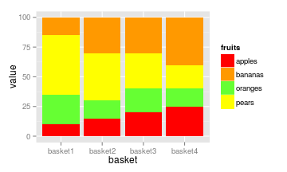
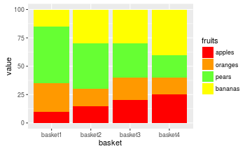
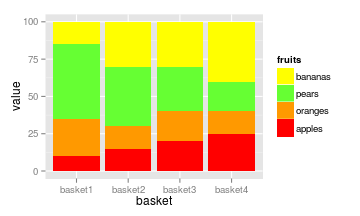
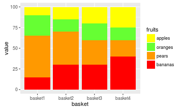
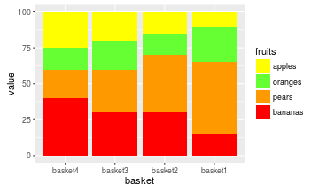
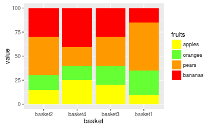
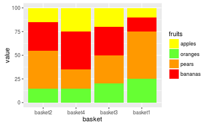
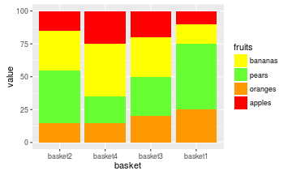
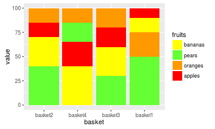

# Data


```r
fruits <- c(rep("apples",4), rep("oranges",4), rep("pears",4),rep("bananas",4))
basket <- rep(c("basket1","basket2","basket3","basket4"),4)
value <- c(10,15,20,25,
           25,15,20,15,
           50,40,30,20,
           15,30,30,40)

df <- data.frame(basket,value,fruits, stringsAsFactors = FALSE)

fill_palette <- c("#FF0000", # red for apple
                  "#FF9900", # orange for orange
                  "#66FF33", # green for pears
                  "#FFFF00" # yellow for bananas
                  )

head(df)
```

```
##    basket value  fruits
## 1 basket1    10  apples
## 2 basket2    15  apples
## 3 basket3    20  apples
## 4 basket4    25  apples
## 5 basket1    25 oranges
## 6 basket2    15 oranges
```

```r
str(df)
```

```
## 'data.frame':	16 obs. of  3 variables:
##  $ basket: chr  "basket1" "basket2" "basket3" "basket4" ...
##  $ value : num  10 15 20 25 25 15 20 15 50 40 ...
##  $ fruits: chr  "apples" "apples" "apples" "apples" ...
```

# Plots

## Without any ordering

- bars are ordered alphabetically by name
- fills are ordered alphabetically by name


```r
library(ggplot2)
ggplot(data=df, 
       aes(x=basket,
           y=value,
           fill=fruits)) +
    geom_bar(stat="identity", 
             position = "stack") +
  scale_fill_manual(values=fill_palette)
```



## Manual ordering

### Manual order the bars


```r
library(ggplot2)
df$basket <- factor(df$basket, levels=c("basket2","basket3","basket1","basket4"))

ggplot(data=df, 
       aes(x=basket,
           y=value,
           fill=fruits)) +
    geom_bar(stat="identity", 
             position = "stack") +
  scale_fill_manual(values=fill_palette)
```


### Manually match the fills with the fruits

Just manually order the factor levels to match the order of colors in `fill_palette`


```r
library(ggplot2)
df$basket <- as.character(df$basket) # resetting the bar ordering
df$fruits <- factor(df$fruits, c("apples","oranges","pears","bananas"))

ggplot(data=df, 
       aes(x=basket,
           y=value,
           fill=fruits)) +
    geom_bar(stat="identity", 
             position = "stack") +
  scale_fill_manual(values=fill_palette)
```




### Reorder the legend to match the order of the fill


```r
library(ggplot2)
df$fruits <- factor(df$fruits, c("apples","oranges","pears","bananas"))

ggplot(data=df, 
       aes(x=basket,
           y=value,
           fill=fruits)) +
    geom_bar(stat="identity", 
             position = "stack") +
  scale_fill_manual(values=fill_palette, 
                    guide = guide_legend(reverse=TRUE))
```



### Reorder the fills manually

**2.0 version of ggplot2 was introduced in late 2015 and `order`aesthetics was depracated.** The new approach is to order the dataset by the grouping variable you want to order by as described in the **2nd** or newest answer for this question: <http://stackoverflow.com/questions/15251816/how-do-you-order-the-fill-colours-within-ggplot2-geom-bar>

**the old `order` way**


```r
library(ggplot2)
df$fruits <- factor(df$fruits, c("bananas","pears","oranges","apples"))

ggplot(data=df, 
       aes(x=basket,
           y=value,
           fill=fruits,
           order=fruits)) + # This WAS important!!
    geom_bar(stat="identity", 
             position = "stack") +
  scale_fill_manual(values=fill_palette, 
                    guide = guide_legend(reverse=TRUE))
```

**With `dplyr`**


```r
library(ggplot2)
df$fruits <- factor(df$fruits, c("bananas","pears","oranges","apples"))

library(dplyr)
ggplot(data=dplyr::arrange(df,fruits), 
       aes(x=basket,
           y=value,
           fill=fruits)) + 
    geom_bar(stat="identity", 
             position = "stack") +
  scale_fill_manual(values=fill_palette, 
                    guide = guide_legend(reverse=TRUE))
```


**With base R**


```r
library(ggplot2)
df$fruits <- factor(df$fruits, c("bananas","pears","oranges","apples"))

ggplot(data=df[order(df$fruits),], 
       aes(x=basket,
           y=value,
           fill=fruits)) + 
    geom_bar(stat="identity", 
             position = "stack") +
  scale_fill_manual(values=fill_palette, 
                    guide = guide_legend(reverse=TRUE))
```




## Automatic reordering

### Order bars according to pears share


```r
library(ggplot2)
df$basket <- factor(df$basket, 
                    levels=df[order(df[df$fruits == "pears",]$value),]$basket)

ggplot(data=df[order(df$fruits),], 
       aes(x=basket,
           y=value,
           fill=fruits)) + 
    geom_bar(stat="identity", 
             position = "stack") +
  scale_fill_manual(values=fill_palette, 
                    guide = guide_legend(reverse=TRUE))
```




### Reverse order bars according to oranges share


```r
library(ggplot2)
df$basket <- factor(df$basket, 
                    levels=df[order(df[df$fruits == "oranges",]$value),]$basket)

ggplot(data=df[order(df$fruits),], 
       aes(x=basket,
           y=value,
           fill=fruits,
           order=fruits)) + 
    geom_bar(stat="identity", 
             position = "stack") +
  scale_fill_manual(values=fill_palette, 
                    guide = guide_legend(reverse=TRUE))
```




### Reverse order bars according to oranges share AND place oranges at the bottom


```r
library(ggplot2)
df$basket <- factor(df$basket, 
                    levels=df[order(df[df$fruits == "oranges",]$value),]$basket)

df$bar_order[df$fruits == "oranges"] <- 1
df$bar_order[df$fruits == "pears"]   <- 2
df$bar_order[df$fruits == "bananas"] <- 3
df$bar_order[df$fruits == "apples"]  <- 4

ggplot(data=df[order(df$bar_order),], 
       aes(x=basket,
           y=value,
           fill=fruits)) +
    geom_bar(stat="identity", 
             position = "stack") +
  scale_fill_manual(values=fill_palette, 
                    guide = guide_legend(reverse=TRUE))
```




### Match the colors with the fruits


```r
library(ggplot2)

fill_palette2 <- c("#FFFF00", # yellow for bananas
                  "#66FF33", # green for pears
                  "#FF9900", # orange for orange
                  "#FF0000" # red for apple
                  )

ggplot(data=df[order(df$bar_order),], 
       aes(x=basket,
           y=value,
           fill=fruits)) + # This is important!!
    geom_bar(stat="identity", 
             position = "stack") +
  scale_fill_manual(values=fill_palette2)
```




## ....


```r
ggplot(data=df[order(-as.numeric(df$value)),], 
       aes(x=basket,
           y=value,
           fill=fruits)) + # This is important!!
    geom_bar(stat="identity", 
             position = "stack") +
  scale_fill_manual(values=fill_palette2)
```




# Links to Stack Overflow etc. on bar ordering

- [How do you order the fill-colours within ggplot2 geom_bar](http://stackoverflow.com/questions/15251816/how-do-you-order-the-fill-colours-within-ggplot2-geom-bar)
- [ggplot legends - change labels, order and title](http://stackoverflow.com/questions/12075037/ggplot-legends-change-labels-order-and-title)
- [ggplot2: Changing the Default Order of Legend Labels and Stacking of Data](https://learnr.wordpress.com/2010/03/23/ggplot2-changing-the-default-order-of-legend-labels-and-stacking-of-data/)
- [How do I re-arrange??: Ordering a plot revisited](https://trinkerrstuff.wordpress.com/2013/08/14/how-do-i-re-arrange-ordering-a-plot-revisited/)
- [Order and color of bars in ggplot2 barplot](http://stackoverflow.com/questions/17331892/order-and-color-of-bars-in-ggplot2-barplot)
- [Legends (ggplot2)](http://www.cookbook-r.com/Graphs/Legends_%28ggplot2%29/)
- [how to change the order of a discrete x scale in ggplot?](how to change the order of a discrete x scale in ggplot?)
