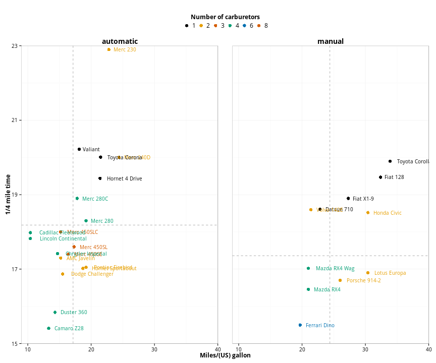
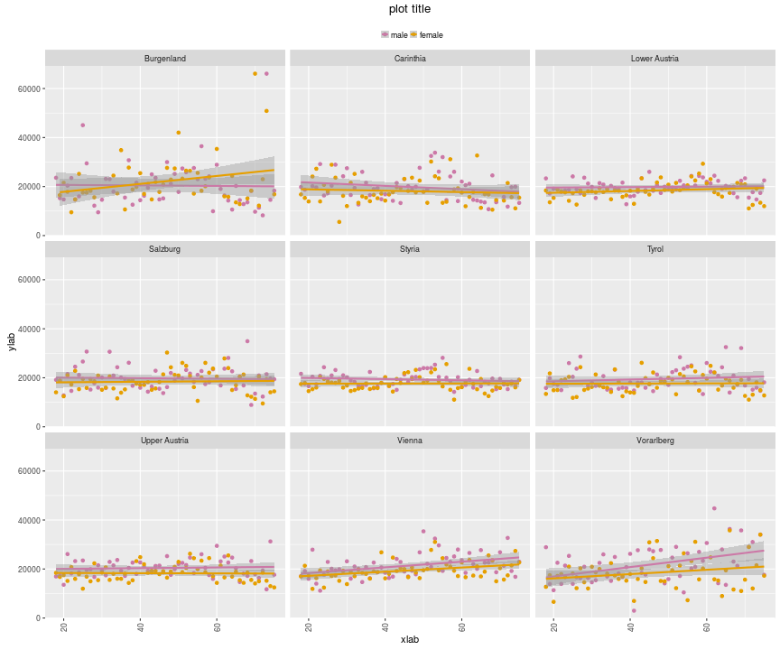
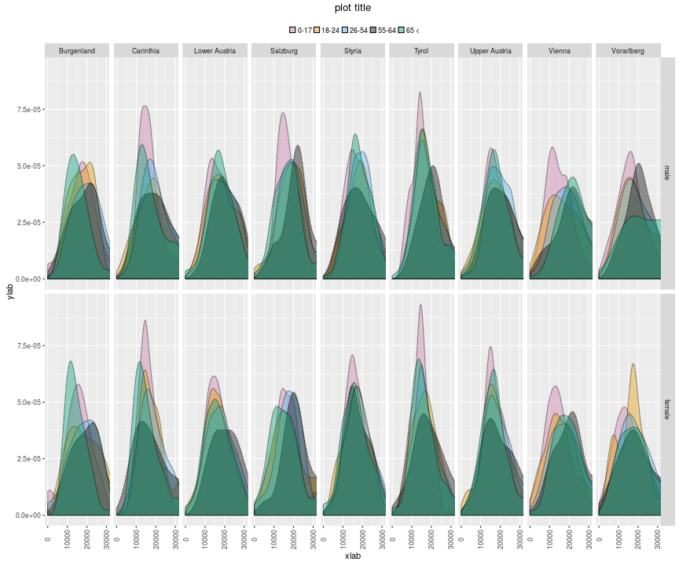
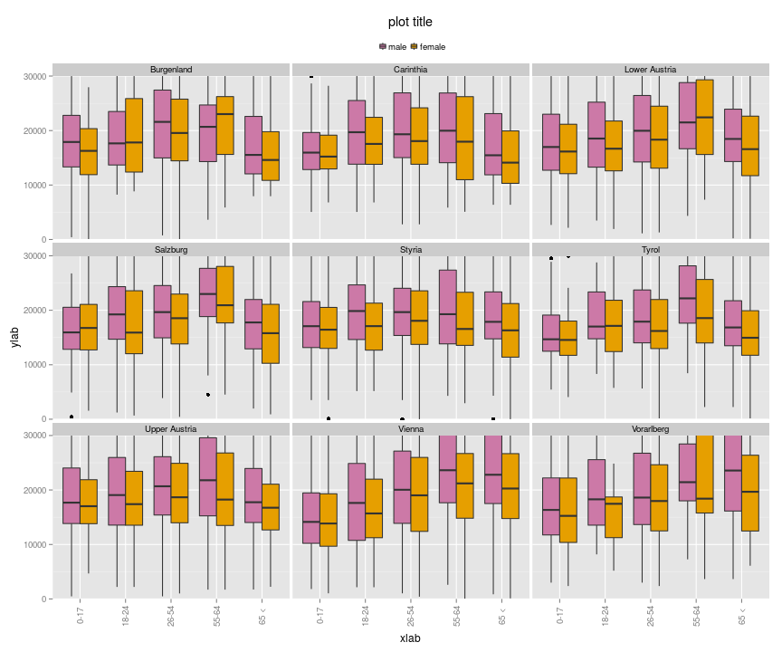

# Graphics using with ggplot2

- [Beautiful plotting in R: A ggplot2 cheatsheet](http://zevross.com/blog/2014/08/04/beautiful-plotting-in-r-a-ggplot2-cheatsheet-3/)
- [Various position adjustments of legend in ggplot2](https://kohske.wordpress.com/2010/12/25/various-position-adjustments-of-legend-in-ggplot2/)

## Moniulotteinen hajontakuvio


```r
library(grid)
library(ggplot2)
mtcars$brands <- row.names(mtcars)     

mtcars$am_c[mtcars$am == 0] <- "automatic"
mtcars$am_c[mtcars$am == 1] <- "manual"
mtcars$am_c <- factor(mtcars$am_c)
# keskiarvoviivat
h.lines <- data.frame(am_c=levels(mtcars$am_c), xval=c(mean(mtcars[mtcars$am_c == "automatic",]$qsec),
                                                         mean(mtcars[mtcars$am_c == "manual",]$qsec)))
v.lines <- data.frame(am_c=levels(mtcars$am_c), xval=c(mean(mtcars[mtcars$am_c == "automatic",]$mpg),
                                                         mean(mtcars[mtcars$am_c == "manual",]$mpg)))

plot <- ggplot(mtcars, aes(x=mpg,y=qsec,label=brands,color=factor(carb)))
plot <- plot + geom_point(size = 3)
plot <- plot + facet_grid(.~am_c) 
plot <- plot + geom_vline(aes(xintercept=xval), data=v.lines, linetype = "dashed", color = "grey70")
plot <- plot + geom_hline(aes(yintercept=xval), data=h.lines, linetype = "dashed", color = "grey70")
plot <- plot + geom_text(family="Open Sans", size=3.5, hjust=-.2, show_guide  = F)
plot <- plot +  labs(x="Miles/(US) gallon",
                     y="1/4 mile time")
plot <- plot + theme_minimal() + 
               theme(legend.position = "top") + 
               theme(text = element_text(family = "Open Sans", size= 12)) +
               theme(legend.title = element_text(size = 12, face = "bold")) +
               theme(axis.text= element_text(size = 10)) +
               theme(axis.title = element_text(size = 12, face = "bold")) +
               theme(legend.text= element_text(size = 12)) +
               theme(strip.text = element_text(size = 14, face="bold")) +
               guides(colour = guide_legend(override.aes = list(size=4)))  +
               theme(panel.border = element_rect(fill=NA,color="grey70", size=0.5, 
                                     linetype="solid"))
plot <- plot + coord_cartesian(xlim=c(9,40),ylim=c(15,23))
plot <- plot + scale_color_manual(values = c("#000000", "#E69F00", "#D55E00", "#009E73","#0072B2","#D55E00"))
plot <- plot + guides(color = guide_legend(title = "Number of carburetors", title.position = "top", title.hjust=.5))
plot <- plot + theme(panel.margin = unit(2, "lines"))
plot
```

 


## Obtaining the data and defining the colors

```r
library(ggplot2)
library(laeken)
data(eusilc)
df <- eusilc
head(df)
```

```
##   db030 hsize db040 rb030 age  rb090 pl030 pb220a   py010n py050n py090n
## 1     1     3 Tyrol   101  34 female     2     AT  9756.25      0      0
## 2     1     3 Tyrol   102  39   male     1  Other 12471.60      0      0
## 3     1     3 Tyrol   103   2   male  <NA>   <NA>       NA     NA     NA
## 4     2     4 Tyrol   201  38 female     7     AT 12487.03      0      0
## 5     2     4 Tyrol   202  43   male     1     AT 42821.23      0      0
## 6     2     4 Tyrol   203  11   male  <NA>   <NA>       NA     NA     NA
##   py100n py110n py120n py130n py140n hy040n  hy050n hy070n hy080n hy090n
## 1      0      0      0      0      0 4273.9 2428.11      0      0  33.39
## 2      0      0      0      0      0 4273.9 2428.11      0      0  33.39
## 3     NA     NA     NA     NA     NA 4273.9 2428.11      0      0  33.39
## 4      0      0      0      0      0    0.0 1549.72      0      0   2.13
## 5      0      0      0      0      0    0.0 1549.72      0      0   2.13
## 6     NA     NA     NA     NA     NA    0.0 1549.72      0      0   2.13
##   hy110n hy130n hy145n eqSS eqIncome    db090    rb050
## 1      0      0      0  1.8 16090.69 504.5696 504.5696
## 2      0      0      0  1.8 16090.69 504.5696 504.5696
## 3      0      0      0  1.8 16090.69 504.5696 504.5696
## 4      0      0      0  2.1 27076.24 493.3824 493.3824
## 5      0      0      0  2.1 27076.24 493.3824 493.3824
## 6      0      0      0  2.1 27076.24 493.3824 493.3824
```

```r
manual.color <- scale_color_manual(values=c("#CC79A7","#E69F00",
                                       "#56B4E9","#000000",
                                       "#009E73","#D55E00",
                                       "#0072B2","#999999",
                                       "#00FF00","Dim Grey",
                                       "#56B4E9","#000000",
                                       "#009E73","#D55E00",
                                       "#0072B2","#999999"))

manual.fill <- scale_fill_manual(values=c("#CC79A7","#E69F00",
                                       "#56B4E9","#000000",
                                       "#009E73","#D55E00",
                                       "#0072B2","#999999",
                                       "#00FF00","Dim Grey",
                                       "#56B4E9","#000000",
                                       "#009E73","#D55E00",
                                       "#0072B2","#999999"))
```


## Bar plot

### Proportions of female and male headed households by region

```r
library(ggplot2)
library(grid)
tbl <- data.frame(prop.table(table(df$db040,df$rb090),1) * 100)
tbl$Freq <- round(tbl$Freq, 1)
# ordering the levels of rdb040 by femla share
df.order <- subset(tbl, Var2 == 'female')
df.order <- df.order[order(df.order$Freq),]
tbl$Var1 <- factor(tbl$Var1, levels = df.order$Var1)
  # bar plot
ggplot(tbl, aes(x=Var2,y=Freq,label=Freq,fill=Var1)) +
  geom_bar(position="dodge", stat="identity") +
  geom_text(position = position_dodge(width=1), vjust=-0.5, size=3) +
  labs(x="xlab",y="ylab") +
  labs(title="plot title") +
  theme(axis.text.x  = element_text(angle=90, vjust= 0.5)) +
  coord_cartesian(ylim=c(0,75)) + 
  annotate("text", x = 1.5, y = 65, label = "Some text here") +
  theme(legend.title=element_blank()) +
  theme(legend.key.size = unit(3, "mm")) +
  theme(legend.position="top") +
  manual.fill
```

 

## Line Plot


```r
df <- read.csv("http://vincentarelbundock.github.com/Rdatasets/csv/Ecdat/Cigarette.csv")
```

```
## Error in file(file, "rt"): cannot open the connection
```

```r
df$year <- as.numeric(df$year)
```

```
## Error in `$<-.data.frame`(`*tmp*`, "year", value = numeric(0)): replacement has 0 rows, data has 14827
```

```r
cnames <- subset(df, year == 1995)
```

```
## Error in eval(expr, envir, enclos): object 'year' not found
```

```r
ggplot(df, 
       aes(x=year,y=packpc,group=state,color=state)) +
  geom_line() + 
  geom_point() +
  scale_x_continuous(breaks=1985:1995) +
  geom_text(data=cnames, aes(x=year,y=packpc,label=state), 
            size=4, hjust=-0.2) +
  labs(x="year",y="number of packs per capita") +
  labs(title="The Cigarette Consumption Panel Data Set") +
  theme(legend.position="none")
```

```
## Error in eval(expr, envir, enclos): object 'year' not found
```

## Scatter plots

### Age vs. household income by region and sex

```r
df <- eusilc
# aggregate a table
tbl <- aggregate(eqIncome~db040+rb090+age, 
                            median,
                            data=df)
# subset to cover ages 18-75
tbl <- subset(tbl, age > 17 & age < 76)
# plot
ggplot(tbl, aes(x=age,y=eqIncome,color=rb090)) +
  geom_point() + 
  facet_wrap(~db040) +
  geom_smooth(method=lm, se=TRUE) +
  labs(x="xlab",y="ylab") +
  labs(title="plot title") +
  theme(axis.text.x  = element_text(angle=90, vjust= 0.5)) +
  theme(legend.title=element_blank()) +
  theme(legend.key.size = unit(3, "mm")) +
  theme(legend.position="top") +
  manual.color
```

 


## Distributions by ageclass, region and gender

### As a density plot


```r
df <- eusilc
df$age_class[df$age < 18] <- '0-17'
df$age_class[df$age >= 18 & df$age < 25] <- '18-24'
df$age_class[df$age >= 25 & df$age < 55] <- '26-54'
df$age_class[df$age >= 55 & df$age < 65] <- '55-64'
df$age_class[df$age >= 65] <- '65 <'

ggplot(df, aes(x=eqIncome,fill=age_class)) +
  geom_density(alpha=.4) +
  facet_grid(rb090~db040) +
  labs(x="xlab",y="ylab") +
  labs(title="plot title") +
  theme(axis.text.x  = element_text(angle=90, vjust= 0.5)) +
  theme(legend.title=element_blank()) +
  theme(legend.key.size = unit(3, "mm")) +
  theme(legend.position="top") +
  coord_cartesian(xlim=c(0,30000)) +
  manual.fill
```

 

### As a box plot


```r
ggplot(df, aes(x=age_class,y=eqIncome, fill=rb090)) +
  geom_boxplot() +
  facet_wrap(~db040) +
  labs(x="xlab",y="ylab") +
  labs(title="plot title") +
  theme(axis.text.x  = element_text(angle=90, vjust= 0.5)) +
  theme(legend.title=element_blank()) +
  theme(legend.key.size = unit(3, "mm")) +
  theme(legend.position="top") +
  coord_cartesian(ylim=c(0,30000)) +
  manual.fill
```

 


