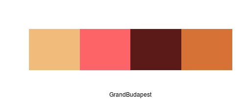
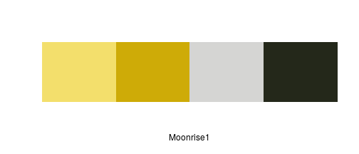
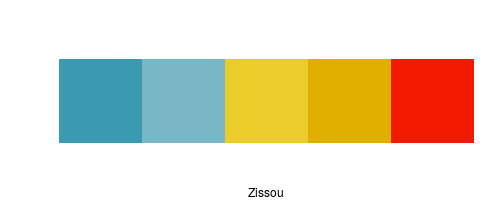
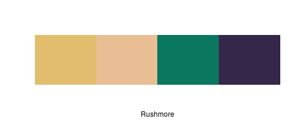
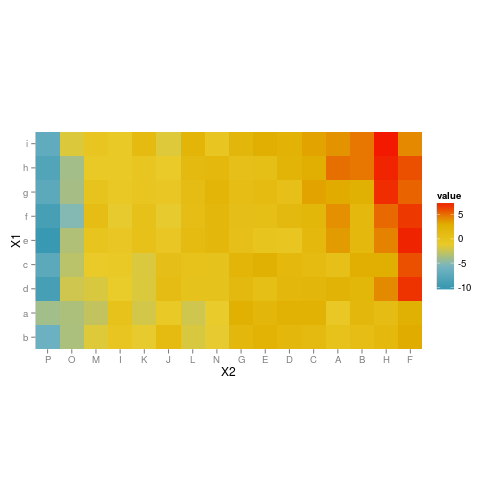

# Värit

## Color brewer

[Cindy Brewer: helping you choose better color scales for maps](http://blog.revolutionanalytics.com/2014/12/cindy-brewer-helping-you-choose-better-color-scales-for-maps.html)


```r
library(RColorBrewer)
display.brewer.all()
```

 


```r
library(ggplot2)
mtcars$brands <- row.names(mtcars)     
df <- mtcars[1:10,]
plot <- ggplot(df, aes(x=brands,y=cyl,fill=factor(carb)))
plot <- plot + geom_bar(stat="identity")
plot <- plot + scale_fill_brewer(palette="Set1")
plot
```

 


```r
library(ggplot2)
mtcars$brands <- row.names(mtcars)     
df <- mtcars[1:8,]
plot <- ggplot(df, aes(x=hp,y=qsec,color=brands,label=brands))
plot <- plot + geom_point()
plot <- plot + geom_text(family = "Gentium", hjust=-.1)
plot <- plot + scale_color_brewer(palette="Dark2")
plot <- plot + theme(legend.position = "none")
plot
```

 


## WesAnderson paletters

- [A Wes Anderson color palette for R](https://github.com/karthik/wesanderson)
- [Wes Anderson Palettes.](http://wesandersonpalettes.tumblr.com/)


```r
library(knitr)
library(wesanderson)
kable(namelist)
```


|movies         | wesnums|
|:--------------|-------:|
|GrandBudapest  |       4|
|Moonrise1      |       4|
|Royal1         |       4|
|Moonrise2      |       4|
|Cavalcanti     |       5|
|Royal2         |       5|
|GrandBudapest2 |       4|
|Moonrise3      |       5|
|Chevalier      |       4|
|Zissou         |       5|
|FantasticFox   |       5|
|Darjeeling     |       5|
|Rushmore       |       5|


```r
display.wes.palette(4, "GrandBudapest")
```

 

```r
display.wes.palette(4, "GrandBudapest2")
```

 

```r
display.wes.palette(4, "Moonrise1")
```

 

```r
display.wes.palette(4, "Moonrise2")
```

 

```r
display.wes.palette(5, "Moonrise3")
```

 

```r
display.wes.palette(4, "Royal1")
```

 

```r
display.wes.palette(5, "Royal2")
```

 

```r
display.wes.palette(4, "Chevalier")
```

 

```r
display.wes.palette(5, "Cavalcanti")
```

 

```r
display.wes.palette(5, "Zissou")
```

 

```r
display.wes.palette(5, "Darjeeling")
```

 

```r
#display.wes.palette(5, "Darjeeling2")
display.wes.palette(4, "FantasticFox")
```

 

```r
display.wes.palette(4, "Rushmore")
```

 


```r
ggplot(iris, aes(Sepal.Length, Sepal.Width, color = Species)) + 
geom_point(size = 3) + 
scale_color_manual(values = wes.palette(3, "GrandBudapest")) + 
theme_gray()
```

 


```r
qplot(factor(cyl), data=mtcars, geom="bar", fill=factor(vs)) + 
scale_fill_manual(values = wes.palette(2, "Royal1"))
```

 


```r
library(wesanderson)
pal <- wes.palette(name = "Zissou", type = "continuous")
# heatmap is a local dataset
ggplot(heatmap, aes(x = X2, y = X1, fill = value)) +
 geom_tile() + 
 scale_fill_gradientn(colours = pal(100)) + 
scale_x_discrete(expand = c(0, 0)) +
scale_y_discrete(expand = c(0, 0)) + coord_equal() 
```

 


