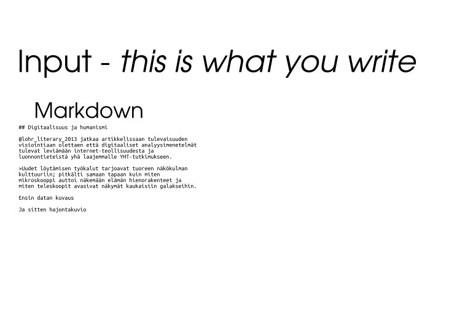

**Knitr-asetukset**


```r
library(knitr)
opts_chunk$set(list(echo=FALSE,eval=TRUE,cache=TRUE,warning=FALSE,message=FALSE))

# tai 

library(knitr)
opts_chunk$set(list(echo=FALSE,eval=TRUE,cache=TRUE,warning=FALSE,message=FALSE,fig.height=4,dev="pdf",opts_chunk$set(fig.path = paste('figure/my-prefix-', org, sep = ''))))
```


## Reproducible documents with R & knitr

**This summary is prepared for FAO R-user group meeting on July 1, 2015**


### Resources

#### R-packages

- [knitr](http://yihui.name/knitr/) - framework for embedding R code in markdown/latex
- [rmarkdown](http://rmarkdown.rstudio.com/) - utilities for converting Rmarkdown/Rlatex into pdf/html/docx etc
- [Sweave](https://www.statistik.lmu.de/~leisch/Sweave/) - the older knitr for purely latex pdf outputs


#### Books

- [Xie, Yihui. Dynamic Documents with R and Knitr. 1 edition. Boca Raton: Chapman and Hall/CRC, 2013.](https://www.crcpress.com/product/isbn/9781482203530)
    - [Github-repo](https://github.com/yihui/knitr-book/)
- [Gandrud, Christopher. Reproducible Research with R and R Studio. Boca Raton: Chapman and Hall/CRC, 2013.](https://www.crcpress.com/product/isbn/9781466572843)
    - [Github-repo](https://github.com/christophergandrud/Rep-Res-Book)


#### Quick tutorials

- [R Markdown — Dynamic Documents for R](http://rmarkdown.rstudio.com/)
- [Rmarkdown cheatsheet](http://www.rstudio.com/wp-content/uploads/2015/02/rmarkdown-cheatsheet.pdf)

#### Related software

- [Pandoc](http://pandoc.org/) - 
- [latex](http://www.latex-project.org/)


### Example 1: R-script into html/pdf

- [Knitr's best hidden gem: spin](http://deanattali.com/2015/03/24/knitrs-best-hidden-gem-spin/)
- [Build a report based on an R script](http://yihui.name/knitr/demo/stitch/)
- [Example](https://github.com/yihui/knitr/blob/master/inst/examples/knitr-spin.R)

**`script.R` looks like this:**


```r
#' This is a R-script that demonstrates how to create plots and tables
#' Load the libraries first
library(knitr)
library(ggplot2)

#' Create a markdown table

kable(head(cars))

#' You can also set chunk options like this
#+ chunk-label, fig=TRUE, height=5, width=FALSE

ggplot(cars, aes(x=speed, y=dist, color=speed)) +
  geom_point() + geom_smooth(method="loess")
```

**Use following commands for conversion in R:**


```r
knitr::spin("script.R")
# Or
rmarkdown::render("script.R")
# Or
rmarkdown::render("script.R", "html_document")
```

**or in Rstudio simply press `Crtl+Shift+k` (or click the icon above the script editor)**

***

**Demo files are here:**

- input: [script.R](script.R)
- pdf output: [script.pdf](script.pdf)
- html output: [script.html](script.html)


### Example 2: Academic paper

**Rmd. source here:**

- <https://raw.githubusercontent.com/muuankarski/faosyb_paper/master/faosyb_paper.Rmd>

To see different formats *rendered* click the links from below:

- pdf: <https://github.com/muuankarski/faosyb_paper/raw/master/faosyb_paper.pdf>
- html: <http://htmlpreview.github.io/?https://raw.githubusercontent.com/muuankarski/faosyb_paper/master/faosyb_paper.html>
- Word: <https://github.com/muuankarski/faosyb_paper/raw/master/faosyb_paper.docx>
- Libreoffice: <https://github.com/muuankarski/faosyb_paper/raw/master/faosyb_paper.odt>


**Templates**

- pdf: <https://github.com/muuankarski/faosyb_paper/blob/master/faosyb.pdf.template>
- html <https://github.com/muuankarski/faosyb_paper/blob/master/faosyb.html.template>
- css for html: <https://github.com/muuankarski/faosyb_paper/blob/master/faosyb.css>


### Example 3: Jekyll povered website

- [This website](http://muuankarski.github.io/luntti/)
- [source](https://github.com/muuankarski/luntti)

## Example 3:: FAO Statistical Pocketbook

- [source](https://github.com/UNFAOstatistics/pocketbook) - constantly updated
    - see also [wiki](https://github.com/unfaostatistics/pocketbook/wiki) for documentation


## Workflow



- [underlaying svg](knitr_gif/analyysi_gif.svg)


# Pandoc


```r
pandoc -s -S --number-section --toc --from=markdown+yaml_metadata_block -H koko_css_mukaan.css source.md -o output.html
#
pandoc -s -S --number-section --toc --from=markdown+yaml_metadata_block --css css_mukana_hakemistossa.css source.md -o output.html
# pdf
pandoc --toc --number-section --latex-engine=xelatex -V lang=english -V papersize:a4paper -V documentclass=scrartcl input.md -o article_demokr.pdf
# word
pandoc --toc --number-section input.md -o article_demokr.docx

pandoc --toc --number-section -s -S -H /home/aurelius/web/css/rmarkdown.css -r markdown+grid_tables+table_captions+yaml_metadata_block paperi-gaudeamus.md -o index.html
```


# Jekyll


Start a new site


```r
jekyll new site
cd site
jekyll serve
# => Now browse to http://localhost:4000
```


Asetukset ko. dokkariin


```r
jekyll serve --watch --baseurl''

# tai

jekyll serve --watch
```


