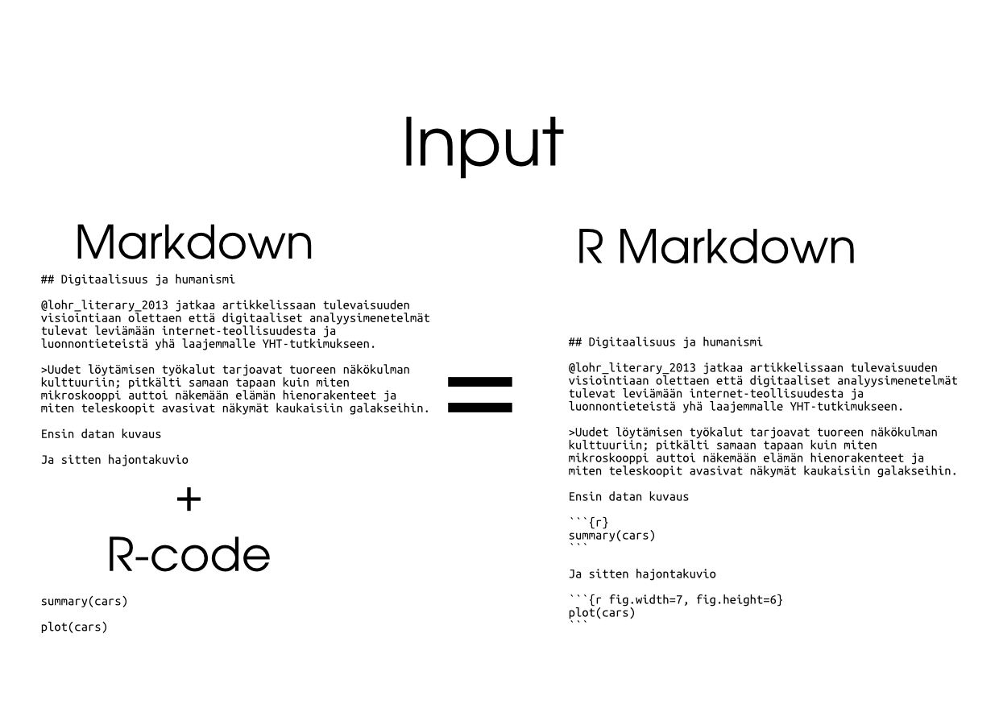
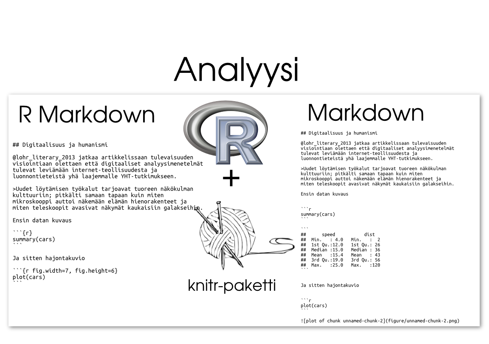
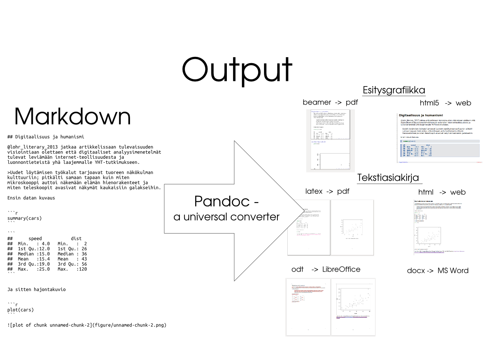

```{r, echo=FALSE}
knitr::opts_chunk$set(list(echo=TRUE,eval=FALSE,cache=FALSE,warning=FALSE,message=FALSE))
```


# Reproducible documents with R & knitr

**This summary is created for FAO R-user group meeting on July 1, 2015**


- [knitr](http://yihui.name/knitr/)-package

## Books

- [Dynamic Documents with R and knitr](https://www.crcpress.com/product/isbn/9781482203530)
    - [Github-repo](https://github.com/yihui/knitr-book/)
- [Reproducible Research with R and R Studio](https://www.crcpress.com/product/isbn/9781466572843)
    - [Github-repo](https://github.com/christophergandrud/Rep-Res-Book)


# Introduction

## Theory

- **Literate programming** is an approach to programming introduced by Donald Knuth in which a program is given as an explanation of the program logic in a natural language, such as English, interspersed with snippets of macros and traditional source code, from which a compilable source code can be generated. [^1]
- **Reproducibility**
    - Reproducibility for the (scientific) community
    - Reprocibility for future you


## Tools

R-packages

- [Sweave](https://www.statistik.lmu.de/~leisch/Sweave/)
- [knitr](http://yihui.name/knitr/)

Rstudio integration

- markdown


Standalone tools 

- Pandoc

## Glossary

- .Rmd -> R Markdown
- .Rnw -> R 

# The Workflow

***
***



***



***



***
***


# Case 1: Simple standalone docs

## R script

- [script.R](script.R)

```{r, eval=FALSE}
knitr::spin("script.R")
```


## R Markdown 

- [rmarkdown.Rmd](rmarkdown.Rmd)


```{r, eval=FALSE}
# into html
knitr::knit2html("rmarkdown.Rmd")
# into latex pdf
knitr::knit2latex("rmarkdown.Rmd")
# into docx
knitr::knit2latex("rmarkdown.Rmd")
# into odt
knitr::knit2latex("rmarkdown.Rmd")
```


## R Sweave

- [rsweave.Rnw](rsweave.Rnw)


```{r, eval=FALSE}
# into latex pdf
knitr::knit2latex("rmarkdown.Rmd")
```


# Case 2: Academic paper with pdf/html output

- [https://github.com/muuankarski/faosyb_paper](https://github.com/muuankarski/faosyb_paper)

# Case 3: Jekyll povered website

- [This website](http://muuankarski.github.io/luntti/)
- [source](https://github.com/muuankarski/luntti)

# Case 4: FAO Statistical Pocketbnook


[^1]: <https://en.wikipedia.org/wiki/Literate_programming>


```{r, eval=TRUE}
sessionInfo()
```


