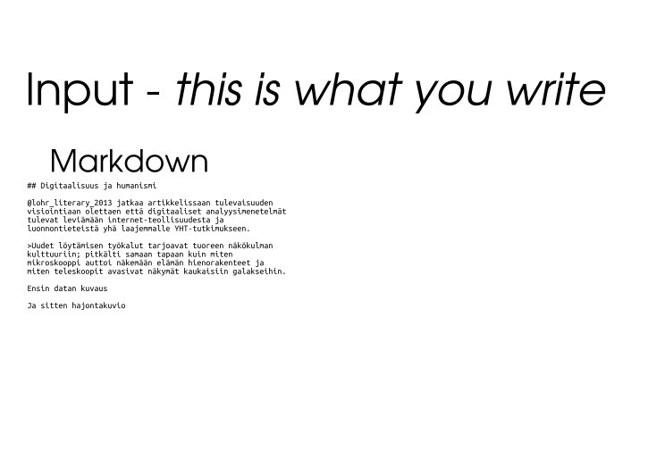

# Reproducible documents with R & knitr

**This summary is prepared for FAO R-user group meeting on July 1, 2015**


## Resources

### R-packages

- [knitr](http://yihui.name/knitr/) - framework for embedding R code in markdown/latex
- [rmarkdown](http://rmarkdown.rstudio.com/) - utilities for converting Rmarkdown/Rlatex into pdf/html/docx etc
- [Sweave](https://www.statistik.lmu.de/~leisch/Sweave/) - the older knitr for purely latex pdf outputs


### Books

- [Xie, Yihui. Dynamic Documents with R and Knitr. 1 edition. Boca Raton: Chapman and Hall/CRC, 2013.](https://www.crcpress.com/product/isbn/9781482203530)
    - [Github-repo](https://github.com/yihui/knitr-book/)
- [Gandrud, Christopher. Reproducible Research with R and R Studio. Boca Raton: Chapman and Hall/CRC, 2013.](https://www.crcpress.com/product/isbn/9781466572843)
    - [Github-repo](https://github.com/christophergandrud/Rep-Res-Book)


### Quick tutorials

- [R Markdown — Dynamic Documents for R](http://rmarkdown.rstudio.com/)
- [Rmarkdown cheatsheet](http://www.rstudio.com/wp-content/uploads/2015/02/rmarkdown-cheatsheet.pdf)

### Related software

- [Pandoc](http://pandoc.org/) - 
- [latex](http://www.latex-project.org/)


## Example 1: R-script into html/pdf

- [Knitr's best hidden gem: spin](http://deanattali.com/2015/03/24/knitrs-best-hidden-gem-spin/)
- [Build a report based on an R script](http://yihui.name/knitr/demo/stitch/)
- [Example](https://github.com/yihui/knitr/blob/master/inst/examples/knitr-spin.R)

**`script.R` looks like this:**


```r
#' This is a R-script that demonstrates how to create plots and tables
#' Load the libraries first
library(knitr)
library(ggplot2)

#' Create a markdown table

kable(head(cars))

#' You can also set chunk options like this
#+ chunk-label, fig=TRUE, height=5, width=FALSE

ggplot(cars, aes(x=speed, y=dist, color=speed)) +
  geom_point() + geom_smooth(method="loess")
```

**Use following commands for conversion in R:**


```r
knitr::spin("script.R")
# Or
rmarkdown::render("script.R")
# Or
rmarkdown::render("script.R", "html_document")
```

**or in Rstudio simply press `Crtl+Shift+k` (or click the icon above the script editor)**

***

**Demo files are here:**

- input: [script.R](script.R)
- pdf output: [script.pdf](script.pdf)
- html output: [script.html](script.html)


## Example 2: Academic paper

**Rmd. source here:**

- <https://raw.githubusercontent.com/muuankarski/faosyb_paper/master/faosyb_paper.Rmd>

To see different formats *rendered* click the links from below:

- pdf: <https://github.com/muuankarski/faosyb_paper/raw/master/faosyb_paper.pdf>
- html: <http://htmlpreview.github.io/?https://raw.githubusercontent.com/muuankarski/faosyb_paper/master/faosyb_paper.html>
- Word: <https://github.com/muuankarski/faosyb_paper/raw/master/faosyb_paper.docx>
- Libreoffice: <https://github.com/muuankarski/faosyb_paper/raw/master/faosyb_paper.odt>


**Templates**

- pdf: <https://github.com/muuankarski/faosyb_paper/blob/master/faosyb.pdf.template>
- html <https://github.com/muuankarski/faosyb_paper/blob/master/faosyb.html.template>
- css for html: <https://github.com/muuankarski/faosyb_paper/blob/master/faosyb.css>


## Example 3: Jekyll povered website

- [This website](http://muuankarski.github.io/luntti/)
- [source](https://github.com/muuankarski/luntti)

## Example 3:: FAO Statistical Pocketbook

- [source](https://github.com/UNFAOstatistics/regional15) - constantly updated
    - see also [wiki](https://github.com/unfaostatistics/regional15/wiki) for documentation


# Workflow



- [underlaying svg](knitr_gif/analyysi_gif.svg)


```r
sessionInfo()
```

```
## R version 3.2.3 (2015-12-10)
## Platform: i686-pc-linux-gnu (32-bit)
## Running under: Ubuntu 14.04.3 LTS
## 
## locale:
##  [1] LC_CTYPE=fi_FI.UTF-8       LC_NUMERIC=C              
##  [3] LC_TIME=fi_FI.UTF-8        LC_COLLATE=fi_FI.UTF-8    
##  [5] LC_MONETARY=fi_FI.UTF-8    LC_MESSAGES=fi_FI.UTF-8   
##  [7] LC_PAPER=fi_FI.UTF-8       LC_NAME=C                 
##  [9] LC_ADDRESS=C               LC_TELEPHONE=C            
## [11] LC_MEASUREMENT=fi_FI.UTF-8 LC_IDENTIFICATION=C       
## 
## attached base packages:
## [1] grid      stats     graphics  grDevices utils     datasets  methods  
## [8] base     
## 
## other attached packages:
##  [1] tidyr_0.3.1        wesanderson_0.3.2  survey_3.30-3     
##  [4] stringr_1.0.0      RColorBrewer_1.1-2 laeken_0.4.6      
##  [7] MASS_7.3-44        KernSmooth_2.23-15 foreign_0.8-66    
## [10] extrafont_0.17     boot_1.3-17        knitr_1.12        
## [13] dplyr_0.4.3        ggplot2_2.0.0     
## 
## loaded via a namespace (and not attached):
##  [1] Rcpp_0.12.3      Rttf2pt1_1.3.3   magrittr_1.5     munsell_0.4.2   
##  [5] colorspace_1.2-6 R6_2.1.1         plyr_1.8.3       tools_3.2.3     
##  [9] parallel_3.2.3   gtable_0.1.2     DBI_0.3.1        extrafontdb_1.0 
## [13] htmltools_0.3    yaml_2.1.13      lazyeval_0.1.10  assertthat_0.1  
## [17] digest_0.6.9     reshape2_1.4.1   formatR_1.2.1    evaluate_0.8    
## [21] rmarkdown_0.9.2  labeling_0.3     stringi_1.0-1    scales_0.3.0
```


